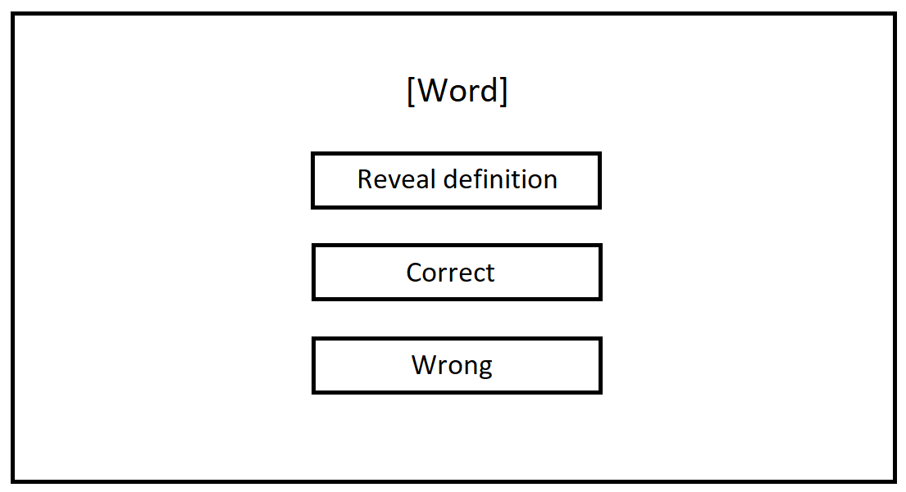
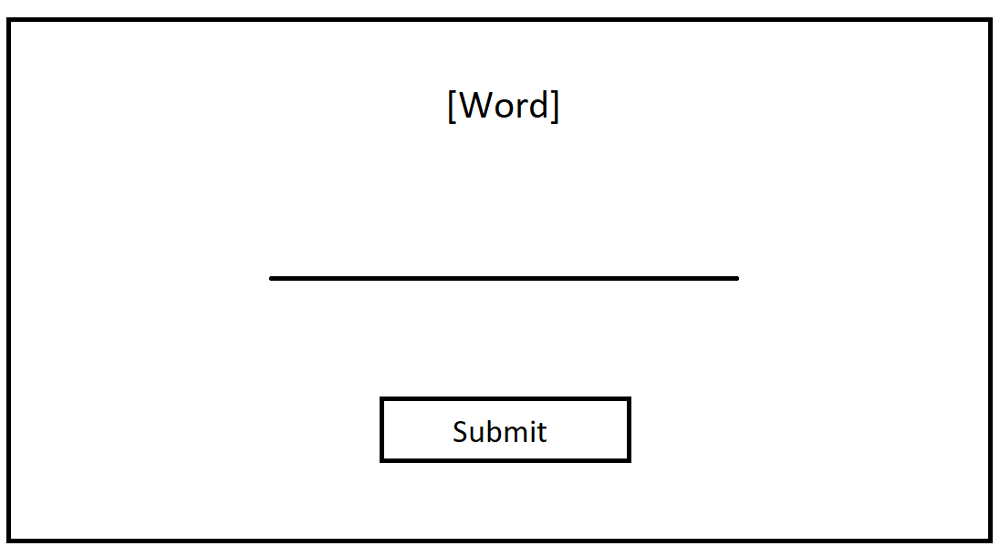

# German Words Practice

Got sick of ads from Quizlet, so decided to create a program that makes an experience that is just as - if not more - interactive, while also being ad free.

## Overview

The .csv file has 4 columns: german_words, english_words, times_correct_g2e and times_correct_e2g.

### german_words
- Self explanatory: the word in German.
### english_words
- Take a guess...
### times_correct_g2e
- A count of how many times the user gets the word correct from German to English.
### times_correct_e2g
- A count of how many times the user gets the word correct from English to German.

The times_correct columns' implementation aims to narrow the user's focus on words they struggle with. Every time it's correct, it increases by 1. Every time it's wrong, it decreases by one. If the score is higher, the word will be increasingly less likely to reappear. This should be able to apply to each of the following modes, but if each have their own distinct difficulty levels, AI may need to be implemented.

## Modes

There will naturally be two modes in this program: German to English, and English to German. This will be the first target, and will be in the form of flashcards. Hopefully something like this:

Eventually, I'll also add multiple choice quizzes. Like this:

And also typing based quizzes. Like this:

## Implementation

The "pandas" module will be used to make use of easily manipulable dataframes to organise data, which can easily and quickly be put into .csv files to save data.

The "sklearn" module may or may not need to be implemented - this module is for developing and using an AI learning model. May be useful to help the user focus on words they struggle with, but a random number generator could also be effective.

## Expandability

Will hopefully add the ability for users to add their own words, and probably entire new .csv files for different languages. There's nothing in this program that limits it to German except the title of the project - I just studied German at school.